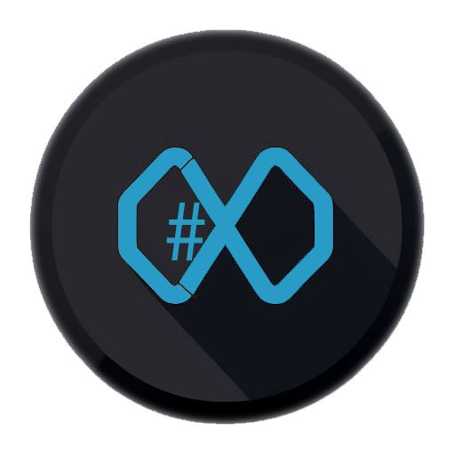

> Proposal for the future GitHub profile README of **@harrybin**.  
> This draft is designed to be copied later into the dedicated GitHub profile repository.

  

  # Harald Binkle

  **Principal Consultant @ Xebia · Microsoft MVP · Speaker · Trainer**

  *Building modern developer workflows with GitHub Copilot, AI agents, React, TypeScript and DevOps.*

  

    
    
    
    
    
  

## About me

I am a fullstack developer, consultant and trainer from Germany with a strong focus on frontend architecture, cloud-native software delivery and developer productivity.

I help teams adopt practical AI workflows, especially around **GitHub Copilot**, **AI agents**, **Model Context Protocol**, **React**, **TypeScript** and **DevOps**.

## Current focus

- 🤖 AI-assisted software delivery with GitHub Copilot and agent-based workflows
- 🧩 MCP tooling and interactive developer experiences
- ⚛️ React, TypeScript and scalable frontend architecture
- ☁️ Cloud applications and microservice-based systems
- 🧪 Test automation with Playwright
- 🎤 Talks, workshops, coaching and knowledge sharing

## Featured work

| Project | What it highlights |
| --- | --- |
| [`visuals-mcp`](https://github.com/harrybin/visuals-mcp) | MCP server for interactive visualizations such as tables, charts, trees and master-detail views |
| [`presentations`](https://github.com/harrybin/presentations) | Public conference talks and workshop decks around Copilot, AI, Dev Containers and frontend topics |
| [`harrybin.github.io`](https://github.com/harrybin/harrybin.github.io) | My developer blog with articles on GitHub Copilot, React, AI workflows and speaking updates |
| [`react-common`](https://github.com/harrybin/react-common) | Reusable React utilities and shared frontend building blocks |

## Speaking & community

I regularly speak and teach about topics such as:

- GitHub Copilot in day-to-day engineering
- Spec-driven and agent-assisted development
- React and modern frontend architecture
- Dev Containers and productive local setups
- Web app localization
- AIOps, maintenance and modernization

Recent public touchpoints include **Sessionize**, **Xebia**, **Microsoft MVP**, **GitHub Copilot Dev Days**, **DWX**, **EKON**, **IT-Tage**, **DDC Cologne** and **.NET Day Franken**.

## Topics I enjoy working with

  
  
  
  
  
  
  
  
  

## Around the web

- 🌐 Blog: https://harrybin.de/
- 💼 LinkedIn: https://www.linkedin.com/in/harald-binkle/
- 🎤 Sessionize: https://sessionize.com/harald-binkle/
- 📚 Presentations: https://presentations.harrybin.de/
- 🧠 MVP profile: https://mvp.microsoft.com/en-US/MVP/profile/8e873a95-57f3-4936-b38e-a43f996533a1

## Optional GitHub widgets

These blocks fit the intended modern style and can be enabled in the final profile repository:

## Content basis

This proposal reflects public information from:

- the blog and about page on **harrybin.de**
- the active social links and branding assets in this repository
- Harald Binkle's public **GitHub**, **Sessionize**, **Microsoft MVP** and **Xebia** presence
- public talk and workshop topics visible via the presentations repository and event pages
