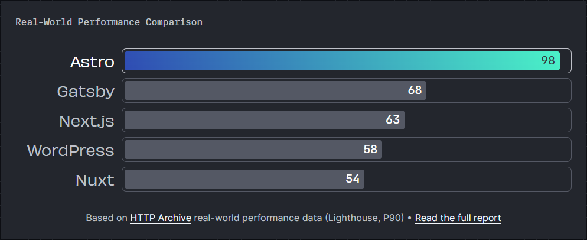
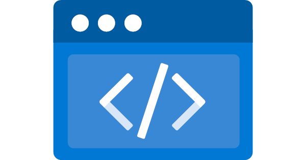

The technologies I used to create this blog are:

- [Github](https://github.com/harrybin/dev_blog)
  - with github actions
- [Astro](https://astro.build/)
  - with the [AstroPaper theme](https://astro-paper.pages.dev/)
- Microsoft Azure
  - Static Web App
  - Application Insights
- [giscus](https://giscus.app/)

## Why are those technologies used and what for?

### GitHub

I guess I don't need to explain anyone reading this why I have chosen GitHub as CV system.
But I assume the more relevant question is why I decided to run a blog driven by a GitHub repo instead of using a hosted CMS like Wordpress.

the simple answer is: I'm a developer, so I like to have full power over the system and don't like to have a black box I need to dig into when something is not working as expected.
Additionally why not use the same technologies I'm using at my daily work to create such blog.

It's really attractive, from the point of a developer view, being able to create a blog post simply adding a markdown file to a folder of my git repo compared to do hundreds of clicks in a bloated CMS web-ui. And at least all the created content is managed by git instead of being an unstructured blob in a database.

### Astro

When talking about my plan to create a blog under those conditions, my colleague [Jonathan David ](https://xpirit.com/team/jonathan-david/) suggested to use [Astro](https://astro.build/), which was a really good choice by now.

With Astro you can either generate static web pages or even SPAs.
the resulting web page Astro generates, static or as SPA, is really fast when loading:


There are also some [themes](https://astro.build/themes/) available, payed and free, where I chose the [AstroPaper theme](https://astro-paper.pages.dev/).
This theme supports React .

As you are able to generate a cool blog with astro the next big question was:

> Where and how do I host my blog?

...since working for [](https://xebia.com/)'s Microsoft service line this question can be answered easily...

### Microsoft Azure

A personal blog should be hosted in a private context. So I decided to use a private Azure account with the free subscription plan and see if I can get all this to work **for free**.

The Azure **Static Web App** is the "cheapest" way for hosting as webpage and can be used in the free plan, so select that one.
The cool thing is, when setting up the Static Web App Azure comes with an assistant suggesting to connect the GitHub repo and automatically generates a GitHub action template for deploying your project.
So you all you need to do is to added the build step for Astro which is only two lines in the action:

```yaml
- name: Build astro content
  uses: withastro/action@v1
```

Then after the deployment is done you can already start using the blog.

But wait...what any statistics. Using a web site means the owner also wants to know is it really used and which parts are used how often. In case of the blog I like to know which article will be read most etc.
Therefore we need some kind of logging and/or metric system.

We are hosting in Azure, so why don't use **Application Insights**? - go for it.
After adding the Azure-AI resource you get a connection string, which is to put into the client.
In my case I decided to use the [script file](https://learn.microsoft.com/en-us/azure/azure-monitor/app/javascript-sdk?tabs=javascriptwebsdkloaderscript) and load it in the layout component of my astro app.

### giscus

Finally I noticed that the blog did not yet give the option to create user comments.

For this **giscus** comes on the stage.</br>
giscus adds support for a commenting section based on the discussing feature of the underlying GitHub repo.
This is really nice, as you don't need to a database or need to take car about authentication.
Feel free to leave me a node using that cool feature right below.
