import Hint from "../../components/Hint.astro";

# Why Build a Speaking Avatar Instead of a Text-Based Chatbot?

Another Chatbot? / The 1001st Tutorial for Creating a Chatbot? No, This Will Be a Speaking Avatar!

Incorporating a speaking avatar into your chatbot experience offers several advantages over a purely text-based interface.
While text-based chatbots are effective for many use cases, a speaking avatar adds a layer of interactivity and engagement
that can significantly enhance user experience. People generally find it more natural and comfortable to converse with a face
than to type out text, making interactions feel more like real conversations.

### Key Benefits:

1. **Enhanced User Engagement**:

   - A speaking avatar creates a more immersive and human-like interaction, making users feel more connected to the avatar.
   - The combination of voice and visual elements captures attention more effectively than text alone.

2. **Accessibility**:

   - Voice interactions in both directions make the avatar accessible to users with visual impairments or those who prefer auditory communication.
   - It also caters to users who may find typing inconvenient or challenging.

3. **Emotional Connection**:

   - A speaking avatar can convey tone, emotion, and personality through voice and facial expressions, fostering a stronger emotional connection with users.
   - This is particularly valuable in applications like mental health support, education, and customer service.

4. **Faster Communication**:

   - Speaking allows for faster information exchange compared to typing and reading text, improving efficiency in scenarios where time is critical.

5. **Brand Differentiation**:

   - A speaking avatar sets your application apart from competitors, showcasing innovation and a commitment to user-centric design.

By integrating a speaking avatar, you can elevate your application from a functional tool to an engaging, accessible, and emotionally resonant experience.

---

## The Goal: Integrating Azure's OpenAI Service, Microsoft Cognitive Services, and Avatar Lip-Syncing for an Interactive AI Avatar

This integration allows users to engage with the avatar through natural speech, enhanced by a visually appealing animated avatar that synchronizes its lip movements with the AI-generated spoken output.

---

## Core Components

### 1. **Microsoft Cognitive Services for Speech Integration**

Microsoft Cognitive Services offers a comprehensive **Speech SDK** with the following features:

- **Speech-to-Text**: Converts spoken language into text.
- **Text-to-Speech**: Synthesizes text into natural-sounding speech.
- **Viseme Data**: Provides viseme data (phoneme-to-lip-shape mappings) to animate avatar lip movements in sync with speech.

#### Functionality:

1. **Speech-to-Text**:

   - The avatar captures user voice input via a microphone.
   - The Speech SDK processes the audio and converts it into text.

2. **Text-to-Speech with Lip-Sync**:
   - The avatar generates a response (e.g., from OpenAI).
   - The Speech SDK converts the text into speech and provides corresponding **viseme data**.
   - The viseme data drives the avatar's lip animations, creating a synchronized visual.

---

### 2. **Azure OpenAI Integration**

Azure OpenAI's GPT models provide the avatar's conversational intelligence, generating contextually relevant responses.

#### Functionality:

1. The avatar sends the user's text input (converted from the user's speech) to the Azure OpenAI API.
2. Azure OpenAI processes the input and returns a generated text response.
3. The response is converted into speech using Microsoft Cognitive Services, and viseme data is provided for animating the avatar.

---

### 3. **Avatar Lip-Syncing Implementation**

Avatar lip-syncing enhances the avatar's visual appeal. Viseme data from Microsoft Cognitive Services drives real-time lip movements.

#### Functionality:

1. The **Speech SDK** generates viseme data during text-to-speech synthesis.
2. Viseme data maps to specific lip shapes.
3. The avatar's lip movements update in real-time based on the viseme data.

---

### 4. **React Application Integration**

The entire functionality is integrated into a React application to be plattform independant.
The React component manages user interactions, displays conversations, and animates the avatar.



---

## Pain Points Solved

Building such a project involves addressing several technical challenges:

1. **Real-Time Synchronization**:

   - Synchronizing the avatar's lip movements with the speech output in real-time requires precise handling of viseme data and rendering updates.
   - Especially in React, you need to take care not to re-render unnecessarily; use states with caution.

2. **Latency Management**:

   - Ensuring low latency in speech recognition, AI response generation, and text-to-speech synthesis is critical for a seamless user experience.
   - Your code for processing the AI model's text results and applying visemes to the avatar needs to be efficient. Otherwise, you will have a large gap between questions and the avatar's answer or improperly synced lips of the avatar.

3. **Getting lip movements clips from the the viseme data**:

   - The viseme data provided by Microsoft Cognitive Services needs to be mapped to specific lip movement animations for the avatar.
   - the viseme data is provided async, so you can't simply process it as it arrives. You need to queue the viseme data and process it in a controlled manner.
   - This requires a good understanding of the avatar's rigging and animation system.

4. **Aborting the speech synthesis**:

   - If the user interrupts the avatar while it is speaking, you need to handle this explicitly as the API only allows a graceful stop of the speech synthesis which leads to audio output continuning for a while.
   - You need to implement a mechanism to stop the speech synthesis and update the avatar's state accordingly.

---

## Rendering the 3D Avatar in React

For rendering an avatar, you first need to get one. There are free avatars available, but most of them are not viseme-capable.

The easiest way is to use a predefined avatar from Microsoft Azure Services. [Here in the Speech Studio](https://speech.microsoft.com/portal/3cf6c385d1e14645a0685128d3b96f23/livechat), you can try out voices and avatar bodies.
There you can play around with the different avatars and voices.
The studio also provides example integration code.

---

## MS Avatar

### Example Usage of MS-Avatar

Below is an example of how to use the `useMSAvatar` hook and `MSAvatarPanel` component to integrate the MSAvatar into your React application:

```tsx
import React, { useRef, useEffect } from "react";
import useMSAvatar from "./useMSAvatar";
import MSAvatarPanel from "./MSAvatarPanel";

function App() {
  const audioRef = useRef < HTMLAudioElement > null;
  const videoRef = useRef < HTMLVideoElement > null;

  const { load, unload, speakNext, stopSpeaking } = useMSAvatar();

  useEffect(() => {
    const avatarConfig = {
      talkingAvatarCharacter: "DefaultCharacter",
      talkingAvatarStyle: "DefaultStyle",
      greenscreen: false,
    };

    const speechConfig = {
      subscriptionKey: "YOUR_SUBSCRIPTION_KEY",
      region: "YOUR_REGION",
      voice: "en-US-JennyNeural", // choose a voice
      speakingStyle: "cheerful",
    };

    if (audioRef.current && videoRef.current) {
      load(avatarConfig, speechConfig, audioRef.current, videoRef.current);
    }

    return () => {
      unload();
    };
  }, [load, unload]);

  const handleSpeak = () => {
    speakNext("Hello! I am your speaking avatar.");
  };

  const handleStop = () => {
    stopSpeaking();
  };

  return (
    <div>
      <MSAvatarPanel audio={audioRef} video={videoRef} />
      <button onClick={handleSpeak}>Speak</button>
      <button onClick={handleStop}>Stop</button>
    </div>
  );
}

export default App;
```

My `MSAvatarPanel` component looks like this:

```tsx
interface MSAvatarPanelProps {
  audio: React.RefObject<HTMLAudioElement | undefined>;
  video: React.RefObject<HTMLVideoElement | undefined>;
}

function MSAvatarPanel({ audio, video }: MSAvatarPanelProps) {
  return (
    <Stack width="auto" height="100%" style={{ background: "white" }}>
      <audio ref={audio as Ref<HTMLAudioElement>} id="audioPlayer" autoPlay />
      <video
        ref={video as Ref<HTMLVideoElement>}
        id="videoPlayer"
        autoPlay
        playsInline
        width="100%"
        height="100%"
      />
    </Stack>
  );
}

export default React.memo(MSAvatarPanel);
```

I will not explain every method imported from the `useMSAvatar` hook, but three of them are essential:

### The `load` method with its `setupWebRTC`

This function is responsible for initializing the avatar and setting up the WebRTC connection. It performs the following tasks:

1. **Avatar Initialization**:

   - Configures the avatar's appearance and behavior using the provided `AvatarConfig` and `SpeechConfig`.
   - Creates an `AvatarSynthesizer` instance to handle speech synthesis and avatar rendering.

2. **WebRTC Setup**:
   - Fetches a relay token from the Microsoft Cognitive Services API to establish a WebRTC connection.
   - Calls the `setupWebRTC` function to configure the WebRTC peer connection, enabling audio and video streaming for the avatar.

This function ensures that the avatar is ready to interact with users by synchronizing its audio and video streams in real-time.

### `speakNext`

This function is responsible for making the avatar speak a given text. It performs the following tasks:

1. **SSML Generation**:

   - Constructs an SSML (Speech Synthesis Markup Language) string to define how the text should be spoken, including voice, style, and other parameters.

2. **Speech Synthesis**:
   - Uses the `AvatarSynthesizer` to convert the SSML into speech and synchronize it with the avatar's lip movements.

This function enables the avatar to deliver dynamic, natural-sounding speech while maintaining synchronization with its visual representation.

---

That was easy - setting up and integrating a ready-to-use avatar provided by Microsoft is quite simple.

<video
  src="https://github.com/harrybin/harrybin.github.io/raw/refs/heads/main/public/assets/ms_harry_avatar.mp4"
  controls
/>

<Hint type="info" title="💡Note:">
  When playing around with different avatars and different language settings, I
  noticed that not every avatar works with every language at least when using a
  custom avatar. So don't wonder if some constellations do not show lip sync at
  all or the lips are not in sync with the voice. When creating the project the
  voices "Leni" and "Jan" for instance didn't provide visemes. If you like to
  know more about visemes, have a look at the [Microsofts: Get facial position
  with
  viseme](https://learn.microsoft.com/en-us/azure/ai-services/speech-service/how-to-speech-synthesis-viseme?tabs=visemeid&pivots=programming-language-javascript)
</Hint>

## Use your own Avatar

I decided to use [Avaturn](https://hub.avaturn.me/) for generating a custom avatar slightly resembling me. This avatar also supports viseme, which is a must in our case. You can export it as a `.glb` file.


But when using a custom avatar, you need to take care of more things yourself:

- start an idle animation when the avatar is not speaking
- stop the idle animation when the avatar starts speaking
- transform viseme data to blend shapes
- map visemes and blend shapes to get animations
- create clips from those animations
- calculate the length of the clips to wait for them to finish before playing the next one
- kill the audio of the speech service when the avatar is aborted

### Loading the Avatar in React

The `.glb` file exported from Avaturn is loaded into the React application using a 3D rendering library like [Three.js](https://threejs.org/) or [react-three-fiber](https://github.com/pmndrs/react-three-fiber). Here's how the avatar is loaded:

1. Import the `.glb` file into the React component using a loader such as `GLTFLoader` from `three/examples/jsm/loaders/GLTFLoader`.
2. Use the `Canvas` component from `react-three/fiber` to render the 3D avatar.
3. Apply viseme data to the avatar's lip movements in real-time during speech synthesis.

- The `.glb` file is loaded into the scene when the React component mounts.
- The avatar's mesh is updated dynamically based on viseme data provided by Microsoft Cognitive Services.

```jsx
import { Canvas } from "@react-three/fiber";
import { GLTFLoader } from "three/examples/jsm/loaders/GLTFLoader";
import { useEffect, useRef } from "react";

function Avatar() {
  const avatarRef = useRef(null);

  useEffect(() => {
    const loader = new GLTFLoader();
    loader.load("/path/to/avatar.glb", gltf => {
      avatarRef.current = gltf.scene;
    });
  }, []);

  return (
    <Canvas>
      {avatarRef.current && <primitive object={avatarRef.current} />}
    </Canvas>
  );
}
```

### Bring it to life

After loading the avatar, you could start the idle animation. The idle animation is a simple loop that keeps the avatar in a neutral state when not speaking.
For controlling this one you need to create a `mixer` object for the 3D scene:

```jsx
const mixer = React.useRef<THREE.AnimationMixer>(undefined);
//... when setting up the scene
mixer.current = new THREE.AnimationMixer(scene);
...
    function startIdle() {
        if (clips.length > 0 && mixer.current) {
            console.log("Playing idle animation");
            const action = mixer.current.clipAction(clips[0]!);
            //set random start of the action of the entry-point fames
            var randomEntryFrame = Math.floor(Math.random() * idleActionEntryPointFrames.length);
            var choosenEntryFrame = idleActionEntryPointFrames[randomEntryFrame] ?? 0;
            if (choosenEntryFrame > 0) action.time = choosenEntryFrame / 60;

            idleAction.current = action;
            action.fadeIn(0.8);
            action.play();
        }
    }
```

In my case I also variied the idle animation by using different entry points of the animation.
This way the avatar looks a bit more lively and not so robotic.

The next step is to connect the output of the speech service to the avatar.
Therefor we connect the `SpeechSynthesisVisemeEvent` with a "VisemeProcessor" which queues and
processes the viseme data until it's rendered under the control of the mixer or aborted.

<Hint type="info" title="💡Note:">
  Viseme data from the service is provided async, so you can't simply process as
  it arrives. That's one of the pain points I mentioned before.
</Hint>

So, how does the `VisemeProcessor` look like?

```tsx
async function processQueue(mixer?: THREE.AnimationMixer) {
  const v = queue.current[0];
  if (v) {
    await processViseme(v, mixer);
    queue.current = queue.current.slice(1);
    if (queue.current.length > 0) {
      await processQueue(mixer);
    } else {
      setTimeout(() => {
        if (!idleAction.current && queue.current.length === 0) {
          processIdle();
        }
      }, 200);
    }
  }
}
```

This function simply decides if there is still viseme data in the queue and if so, it processes it. If not, it starts the idle animation.

The `processViseme` function is responsible for processing the viseme data and updating the avatar's lip movements accordingly. It uses the `mixer` to control the animation of the avatar based on the viseme data.

```tsx
async function processViseme(
  viseme: sdk.SpeechSynthesisVisemeEventArgs,
  m?: THREE.AnimationMixer
) {
  const animation = tryParseJSON(viseme.animation);
  if (!animation) return;

  const blendData = buildBlendData(animation);
  let morphTargetDictionary: { [key: string]: number } = {};
  const armature = gltf.scene.getObjectByName("Armature") as THREE.Object3D;
  //find the morphTargetDictionary
  armature.traverse(x => {
    const target = x as THREE.Mesh;
    if (
      target.morphTargetInfluences &&
      target.morphTargetInfluences.length &&
      target.morphTargetDictionary &&
      target.name === config.meshName
    ) {
      morphTargetDictionary = target.morphTargetDictionary;
      return;
    }
  });
  const a = createAnimation(blendData, morphTargetDictionary, config.meshName);
  const ca = m?.clipAction(a!);
  if (ca) {
    ca.setLoop(THREE.LoopOnce, 1);
    ca.clampWhenFinished = true;
    if (idleAction.current) {
      idleAction.current = undefined;
    }
    ca.play();
    if (a && a.duration !== undefined) {
      // wait for the animation to be finished
      await new Promise(async r => setTimeout(r, a.duration * 1000));
    }
    // if not stopped the animations will become smaller and smaller (in their weight)
    ca.stop(); // Tells the mixer to deactivate this action. The action will be immediately stopped and completely reset. this is needed to remove it from the weigth calculation.
  }
}
```

The `createAnimation` function creates a new animation clip based on the viseme data and blend shapes. It uses the `THREE.AnimationClip` class and the `morphTargetDictionary` to create the animation and set its duration.
The exact implementation of this may differ depending on the morphTargetDictionary structure of your avatar. In general, it's only a mapping of the visemes to the clips in the `morphTargetDictionary` using `BLEND_SHAPE_NAMES` as keys.
Finally, the `AnimationClip`s are turned into `ClipAction`s which are then played. Unfortunately, for playing the clips there is no synchronous method, so we need to wait for the clip to finish before we can play the next one.

<Hint type="info" title="💡Note:">
  You need to stop each `ClipAction` after it's done. If you don't do that, your
  animations will become smaller and smaller (in their weight) until they are
  not visible anymore. This is also because the `AnimationMixer` calculates the
  weight of all active `ClipAction`s and if you don't stop them, they will be
  added to the weight calculation.
</Hint>

If everything is connected correctly, the avatar should now be able to speak and animate its lips in sync with the speech output from Microsoft Cognitive Services.

### Aborting the Speech Synthesis

When the user likes to interrupt the bot while it is speaking, you need to handle this explicitly. The API only allows a graceful stop of the speech synthesis, which leads to audio output continuing for a while.
You need to implement a mechanism to stop the speech synthesis and update the avatar's state accordingly.

When accessing the speech service, you created a synthesizer object. This object has a `close` method which is supposed to stop the speech synthesis.
But as mentioned before, this will not stop the audio output immediately. This is also tracked with an issue in the [Microsoft Cognitive Services GitHub repository](https://github.com/Azure-Samples/cognitive-services-speech-sdk/issues/2350#issuecomment-2421535922).
As a workaround, I found out that you can use some private objects of the synthesizer to stop the audio output immediately.

I do that additionally to the `close` method of the synthesizer:

```tsx
async function killSynthesizer() {
  if (synthesizer.current !== undefined) {
    console.log("Killing synthesizer");

    KillAudio(synthesizer.current);

    synthesizer.current.close();
    synthesizer.current = undefined;
  }
}

//DANGER!FRAGILE uses private objects to work around issue: https://github.com/Azure-Samples/cognitive-services-speech-sdk/issues/2350
function KillAudio(synthesizer: sdk.SpeechSynthesizer) {
  // kill the audio
  // @ts-ignore // private :D
  const audio: HTMLAudioElement | undefined =
    synthesizer.privAdapter?.privSessionAudioDestination?.privDestination
      ?.privAudio;
  if (audio) {
    audio.pause();
    audio.currentTime = 0;
  }
}
```

...voila, now the audio output stops immediately and the avatar is not speaking anymore.

<video
  src="https://github.com/harrybin/harrybin.github.io/raw/refs/heads/main/public/assets/custom_avatar.mp4"
  controls
/>
_Obviously, the beginning of the idle animation, you can see when it starts
again at the end of the video, is not really what is expected to be. But in this
case it's a really good one for showcasing because of the large movement._

## Conclusion

In this article, we explored how to create a speaking avatar using Microsoft Cognitive Services and Azure OpenAI. We covered the integration of speech-to-text and text-to-speech capabilities, as well as the implementation of lip-syncing for a more engaging user experience.
By leveraging the power of these technologies, we can build interactive and immersive applications that enhance user engagement and accessibility.
This project served as a foundation for creating more advanced AI bots with speech capabilities.
Some ideas to further enhance it areadding features like emotion detection, personalized responses, and more sophisticated animations.
This is just the beginning of a new era in AI interaction,
and I hope this article inspires you to explore the possibilities of creating your own speaking avatars.
