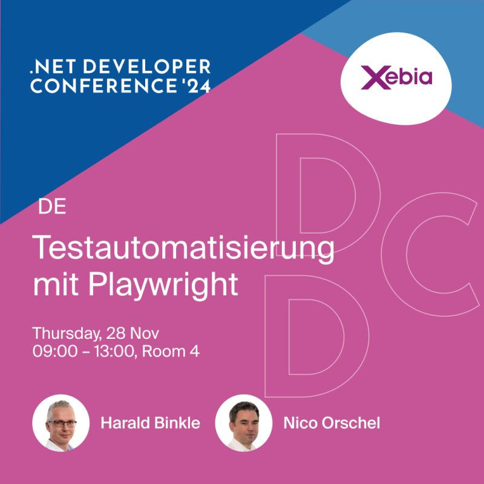
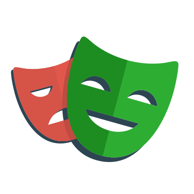

The workshop will be held in German, so let's switch to German for the rest of this post:

Am **28. November 2024** findet die `DDC Cologne 2024` statt.

Zusammen mit meinem Kollegen `Nico Orschel`, werde ich am Workshop-Tag (Samstag) einen [Workshop](https://www.dotnet-developer-conference.de/programm/) halten.

## Workshop: Testautomatisierung für WebApps mit Playwright

Begleitet uns auf eine Entdeckungsreise durch die Erstellung von automatisierten Tests für Webanwendungen mit Playwright.
Dieser Workshop bietet praktische Einblicke in die Entwicklung und Implementierung von Testautomatisierungslösungen, die die Zuverlässigkeit und Wartbarkeit von Webanwendungen verbessern. Eine ideale Lerngelegenheit für Entwickler, die ihre Testfähigkeiten erweitern möchten.

Mehr Infos zum Workshop gibt es auch in meinem [Sessionize Profil](https://sessionize.com/s/harald-binkle/testautomatisierung-fur-webapps-mit-playwright/85731).
