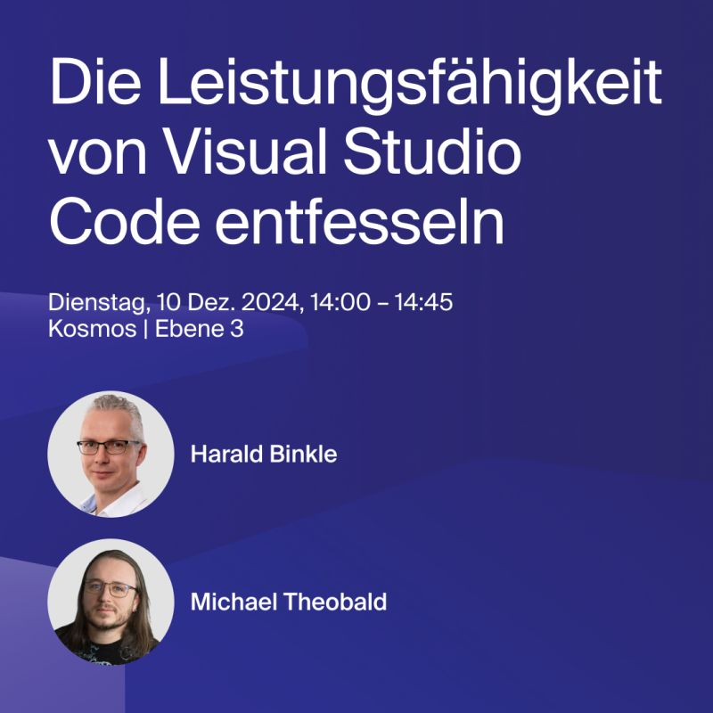

The talk will be held in German, so let's switch to German for the rest of this post:

Am **10. Dezember 2024** finden die `IT-Tage Frankfurt 2024` statt.

Ich freue mich, am Konferenz-Tag (Dienstag) einen [Talk](https://www.ittage.informatik-aktuell.de/speaker/harald-binkle.html) zu präsentieren.

## Talk: Die Macht von `VS-Code` entfesseln

Schaut euch an, wie wir die außergewöhnlichen Funktionen von Visual Studio Code demonstrieren und welche wesentlichen Erweiterungen für die Full-Stack-Entwicklung mit Web-Frontends (z. B. React), C#-Backends und CI/CD-Umgebungen wie Azure DevOps oder GitHub wir empfehlen.

Mehr Infos zum Talk gibt es auch in meinem [Sessionize Profil](https://sessionize.com/s/harald-binkle/die-leistungsfahigkeit-von-visual-studio-code-entf/85603).
