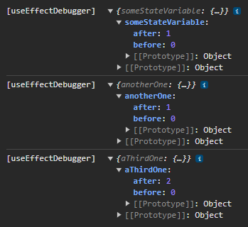

## The useEffect hook may be the most used hook in React beside the useState hook

Nearly every react component having its own state needs to react on state changes.
In most cases you need to use the useEffect hook for implementing that state change reaction.
Beside the the first parameter containing the logic you can use the second one, the dependency array, to filter for which state variables this hook will be executed when they change.

## how to determine which of the dependency variables triggered the change

Say you've got a useEffect definition with three dependency variables, similar to the one below:

```typescript
function MyComponent()=>{
  useEffect(() => {
    //code here
  }, [someStateVariable, anotherOne, aThirdOne]);

  return <>[...]</>
}
```

Now when testing your feature you recognize that there is something wrong.
The code inside your useEffect hook to executed too often.
You have a look at the dependency array and what... you guess which of these three variables causes the unwanted re-rendering/execution?
When debugging you can determine how often it's called, but don't see which variable causes the calls.
Is it one variable causing it several time, is it two or all three?

For investigating this you can create a custom hook tracking state changes and use that one instead of the useEffect hook for such debugging purposes.
Or you simply use the `useEffectDebugger` from my npm package [@harrybin/react-common](https://www.npmjs.com/package/@harrybin/react-common) --> [useEffectDebugger](https://harrybin.de/react-common/typedoc/functions/.utils.useEffectDebugger.html).

For using the `useEffectDebugger` hook you simple 
- install and import it from [@harrybin/react-common](https://www.npmjs.com/package/@harrybin/react-common)
- rename your existing `useEffect` to `useEffectDebugger`
- (optional) and for better reading add a second array as third parameter containing the variable names of the dependency array

```typescript
function MyComponent()=>{
  useEffectDebugger(() => {
    //code here
  }, [someStateVariable, anotherOne, aThirdOne], ["someStateVariable", "anotherOne", "aThirdOne"]);

  return <>[...]</>
}
```
Now reproduce the issue again and you will find the variables including their values logged to the console when they cause that useEffect method to be executed:

